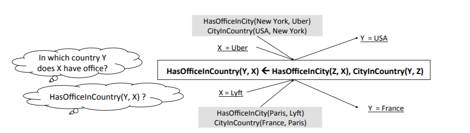

# Logic Rules-based Reasoning
 
In order to respond to one of the main challenges of Artificial Intelligence (AI), that is, the effective integration of learning and reasoning (Valiant 2008), both symbolic inference and statistical learning need to be combined in an effective way. 

*Key words*: Symbolic, Logic Rules, Reasoning

## Summary
* [Papers](#papers)
	* [Traditional Approaches](#traditional-approaches)
	* [Combining Embedding Model with Logic Rules](#combining-embedding-model-with-logic-rules)
		* [Designing logic rule-based regularization to embedding models](#designing-logic-rule-based-regularization-to-embedding-models)
		* [Designing embedding-based variational distribution for variational inference of MLN](#designing-embedding-based-variational-distribution-for-variational-inference-of-MLN)
	* [Combining Neural Network with Logic Rules](#combining-neural-network-with-logic-rules)
* [Surveys](#surveys)
* [Courses](#courses)
* [Active Researchers](#active-researchers)

## Papers

### Traditional Approaches
Traditional approaches represented by Markov Logic Network attempts to conductthe inference via logic rules. They combine probability and first-order logic via probabilistic graphical model.

* Markov Logic Networks [[paper]](https://homes.cs.washington.edu/~pedrod/papers/mlj05.pdf) [[Code]](http://alchemy.cs.washington.edu/)
	* Brief overview: MLN is the  most widely  used  probabilis-tic graphical model in handling first-order logic-based reasoning,where each unknown predicate corresponds to a binary randomvariable and each ground logic rule corresponds to a factor. 
	* Authors: Matthew Richardson and Pedro Domingos
	* Venue: Machine learning
	* Citation: 2854
* Probabilistic Inductive Logic Programming [[paper]](https://people.csail.mit.edu/kersting/ecmlpkdd05_pilp/pilp.pdf)
	* Brief overview: The paper outlines three classical settings for inductive logic programming, namely learning from entailment, learning from interpretations, and learning from proofs or traces, and show how they can be used to learn different types of probabilistic representations.
	* Authors: Luc De Raedt and Kristian Kersting
	* Venue: Probabilistic Inductive Logic Programming
	* Citation: 441
* Lifted First-Order Belief Propagation [[paper]](https://homes.cs.washington.edu/~pedrod/papers/aaai08a.pdf)
	* Brief overview: The paper proposes the first lifted version of a scalable probabilistic inference algorithm, belief propagation (loopy or not). It constructs a lifted network, where each node represents a set of ground atoms that all pass the same messages during belief propagation. 
	* Authors: Parag Singla Pedro Domingos
	* Venue: AAAI'08
	* Citation: 441

### Combining Embedding Model with Logic Rules
Although KB embedding provides a promising approach for knowl-edge inference, the ignorance of the symbolic compositionality ofKG relations limits their reasoning ability. Several attempts havebeen made to combine the power of logic rules in knowledge inference with embedding models in recent years.

#### Designing logic rule-based regularization to embedding models
They treat logic rules as additional knowledge to embedding models, where satisfaction of ground rules is integrated into the original embedding loss. A typical integration is defined as follows: (1) sampling ground logic rules given the template logic rules; (2) mapping each related triple (i.e., predicate) into a confidence score (i.e., soft truth value); (3) computing the satisfaction score to each ground rule based on its predicates' scores; and (4) defining proper loss based on the satisfaction score for all the ground rules.

* [**Jointly Embedding Knowledge Graphs and Logical Rules**](https://www.aclweb.org/anthology/D16-1019.pdf)
	* Brief overview: KALE incorporates logic rules into embedding models by defining loss based on the satisfaction score for the ground rules. 
	* Authors: Shu Guo, Quan Wang, Lihong Wang, Bin Wang and Li Guo
	* Venue: EMNLP'16
	* [**Code**](https://github.com/iieir-km/KALE)
	* Citation: 64
* [**Knowledge Graph Embedding with Iterative Guidance from Soft Rules**](https://arxiv.org/pdf/1711.11231.pdf)
	* Brief overview: RUGE injects logic rules into the learned embeddings in an iterative manner by enforcing the unobserved data to be consistent with the soft label predicted by rules.
	* Authors: Shu Guo, Quan Wang, Lihong Wang, Bin Wang and Li Guo
	* Venue: AAAI'18
	* [**Code**]( https://github.com/iieir-km/RUGE.)
	* Citation: 37
* [**Injecting Logical Background Knowledgeinto Embeddings for Relation Extraction**](https://rockt.github.io/pdf/rocktaschel2015injecting.pdf)
	* Brief overview: Instead of learning entity embeddings for individual entity, it utilizes matrix factorization to learn joint embeddings of pairs of entities as well as embeddings of relations. Logistic loss is used to maximize the soft truth value of positive formulaes.
	* Authors: Tim Rocktaschel, Sameer Singh and Sebastian Riedel
	* Venue: ACL'15
	* Citation: 137
* [**Lifted Rule Injection for Relation Embeddings**](https://arxiv.org/pdf/1606.08359.pdf)
	* Brief overview: The paper develops a very efficient way of regularizing relation representations to incorporate first-order logic implications.
	* Authors: Thomas Demeester, Tim Rocktäschel and Sebastian Riedel.
	* Venue: EMNLP'16
	* Citation: 57
* [**Knowledge Base Completion Using Embeddings and Rules**](https://www.ijcai.org/Proceedings/15/Papers/264.pdf)
	* Brief overview: The paper formulates inference as an integer linear programming (ILP) problem, with the objective function generated from embedding models and the constraints translated from rules.
	* Authors: Quan Wang, Bin Wang and Li Guo
	* Venue: IJCAI'15
	* Citation: 106
* [**Improving Knowledge Graph Embedding Using Simple Constraints**](https://arxiv.org/pdf/1906.08495.pdf)
	* Brief overview: This paper investigates the potential of using entailment constraints to improve KG embedding. It examines non-negativity constraints on entity representations and approximate entailment constraints on relation representations. 
	* Authors: Boyang Ding, Quan Wang, Bin Wang, Li Guo
	* Venue:ACL'18
	* [**Code**](https://github.com/iieir-km/ComplEx-NNE_AER)
	* Citation: 21

#### Designing embedding-based variational distribution for variational inference of MLN
They proposed to conduct variational inference of MLN byleveraging embeddings to define variational distribution of all pos-sible triples.

* [**Probabilistic Logic Neural Networks for Reasoning**](https://arxiv.org/pdf/1906.08495.pdf)
	* Brief overview: The paper defines the joint distribution of all possibletriplets by using a MLN with first-order logic, which can beefficiently optimized with the variational EM algorithm.
	* Authors: Meng Qu, Jian Tang
	* Venue: NeurIPS'19
	* [**Code**](https://github.com/DeepGraphLearning/pLogicNet)
	* Citation: 2
* [**Efficient Probabilistic Logic Reasoning with Graph Neural Networks**](https://openreview.net/attachment?id=rJg76kStwH&name=original_pdf)
	* Brief overview: The paper proposes to use graph neural networks (GNN) for inference in MLN. GNN is used for learning representations for Knowledge graphs which is quite scalable when it comes to probabilistic inference. 
	* Authors: Yuyu Zhang, Xinshi Chen, Yuan Yang, Arun Ramamurthy, Bo Li, Yuan Qi and Le Song
	* Venue: ICLR'20
	* [**Code**](https://github.com/expressGNN/ExpressGNN)

### Combining Neural Network with Logic Rules
Neural-Symbolic Learning and Reasoning seeks to integrate principles from neuralnetworks learning and logical reasoning. It is an interdisciplinary field involving components of knowledge representation, neuroscience, machine learning and cognitive science. 

#### Reasoning Orientated
* [**Neural-Symbolic Learning and Reasoning: Contributions and Challenges**](https://www.aaai.org/ocs/index.php/SSS/SSS15/paper/download/10281/10029)
	* Brief overview: The paper recalls the main contributions and discusses key challenges for neural-symbolic integration which have been identified at a recent Dagstuhl seminar. 
	* Authors: Artur d’Avila Garcez, Tarek R. Besold, Luc de Raedt, Peter Földiak, Pascal Hitzler, Thomas Icard, Kai-Uwe Kühnberger, Luis C. Lamb, Risto Miikkulainen and Daniel L. Silver 
	* Venue: AAAI'15
	* Citation: 63
* [**Bayesian representation learning with oracle constraints**](https://arxiv.org/pdf/1506.05011.pdf)
	* Brief overview: The paper proposes to combine generative unsupervised feature learning with a probabilistic treatment of oracle information like triplets in order to transfer implicit privileged oracle knowledge into explicit nonlinear Bayesian latent factor models of the observations.
	* Authors: Theofanis Karaletsos, Serge Belongie, Gunnar Rätsch
	* Venue: ICLR'16
	* Citation: 40
* [**DeepProbLog: Neural Probabilistic Logic Programming**](https://arxiv.org/pdf/1805.10872.pdf)
	* Brief overview: DeepProbLog supports both symbolic and subsymbolic representations and inference, 1) program induction, 2) probabilistic (logic) programming, and 3) (deep) learning from examples.
	* Authors: Robin Manhaeve, Sebastijan Dumančić, Angelika Kimmig, Thomas Demeester, Luc De Raedt
	* Venue: NeurIPS'18
	* Citation: 55
* [**Harnessing Deep Neural Networks with Logic Rules**](https://arxiv.org/pdf/1603.06318.pdf)
	* Brief overview: The paper enables a neural network to learn simultaneously from labeled instances as well as logic rules, through an iterative rule knowledge distillation procedure that transfers the structured information encoded in the logic rules into the network parameters. 
	* Authors: Zhiting Hu, Xuezhe Ma, Zhengzhong Liu, Eduard Hovy, Eric Xing
	* Venue: ACL'16
	* [**Code**](https://github.com/ZhitingHu/logicnn)
	* Citation: 227
* [**Deep Neural Networks with Massive Learned Knowledge**](https://www.cs.cmu.edu/~rsalakhu/papers/emnlp16deep.pdf)
	* Brief overview: The paper introduce a generalized framework which enables a learning procedure for knowledge representations and their weights jointly with the regulated DNN models.
	* Authors: Zhiting Hu, Zichao Yang, Ruslan Salakhutdinov, Eric P. Xing
	* Venue: EMNLP'16
	* Citation: 28
* [**Deep Probabilistic Logic: A Unifying Framework for Indirect Supervision**](https://arxiv.org/pdf/1808.08485.pdf)
	* Brief overview: The paper proposes deep probabilistic logic (DPL) to models label decisions as latent variables, represents prior knowledge on their relations using weighted first-order logical formulas, and alternates between learning a deep neural network for the end task and refining uncertain formula weights for indirect supervision, using variational EM.
	* Authors: Hai Wang, Hoifung Poon
	* Venue: arXiv
	* Citation: 7
* [**Knowledge-Based Artificial Neural Networks**](ftp://ftp.cs.wisc.edu/machine-learning/shavlik-group/towell.aij94.pdf)
	* Brief overview: KBANN is a hybrid learning system built on top of connectionist learning techniques. It maps problem-specific “domain theories”, represented in propositional logic, into neural networks and then refines this reformulated knowledge using back propagation.
	* Authors: Geoffrey G. Towell and Jude W. Shavlik
	* Venue: Artificial intelligence
	* Citation: 892
	
#### Rules Learning Orientated
* [**End-to-End Differentiable Proving**](https://arxiv.org/pdf/1705.11040.pdf)
	* Brief overview: The paper describes a unified approach to learning deep neural networks with a symbolic AI approach. Specifically, based on prolog's backward conditioning approach, the neural network is constructed recursively to prove facts in a Knowledge base. The authors develop differentiable operations for unification, AND and OR. Vector representations of symbols help in sub symbolic matching for symbols that are similar but not identical. 
	* Authors: Tim Rocktäschel and Sebastian Riedel
	* Venue: NeurIPS'17
	* Citation: 107
* [**Differentiable Learning of Logical Rules for Knowledge Base Reasoning**](https://arxiv.org/pdf/1702.08367.pdf)
	* Brief overview: The paper proposes a framework, Neural Logic Programming, that combines the parameter and structure learning of first-order logical rules in an end-to-end differentiable model. This approach is inspired by a recently-developed differentiable logic called TensorLog, where inference tasks can be compiled into sequences of differentiable operations. 
	* Authors: Fan Yang, Zhilin Yang, William W. Cohen
	* Venue: NeurIPS'17
	* [**Code**](https://github.com/fanyangxyz/Neural-LP)
	* Citation: 76
* [**Learning Explanatory Rules from Noisy Data**](https://arxiv.org/pdf/1711.04574.pdf)
	* Brief overview: Programming (∂ILP) is a reimplementation of ILP in an an end-to-end differentiable architecture. It proposes a data-efficient induction system that can learn explicit human-readable symbolic rules. The central component of this system is a differentiable implementation of deduction through forward chaining on definite clauses. 
	* Authors: Richard Evans and Edward Grefenstette
	* Venue: IJCAI'18
	* Citation: 88
* [**Neural Logic Machines**](https://arxiv.org/pdf/1702.08367.pdf)
	* Brief overview: NLMs use tensors to represent logic predicates. This is done by grounding the predicate as True or False over a fixed set of objects. Based on the tensor representation, rules are implemented as neural operators that can be applied over the premise tensors and generate conclusion tensors.
	* Authors: Honghua Dong, Jiayuan Mao, Tian Lin, Chong Wang, Lihong Li and Denny Zhou
	* Venue: ICLR'19
	* [**Code**](https://github.com/google/neural-logic-machines)
	* Citation: 10
* [**Neural Markov Logic Networks**](https://openreview.net/pdf?id=SkeGvaEtPr)
	* Brief overview: The paper presents Neural Markov Logic Networks (NMLN), which is a generalization of Markov Logic Networks (MLN). Unlike MLN which relies on pre-specified first-order logic (FOL) rules, NMLN learns potential functions parameterized by neural networks on fragments of the graph. 
	* Authors: Giuseppe Marra, Ondřej Kuželka

## Surveys:
* [**Neural-Symbolic Learning and Reasoning: A Survey and Interpretation**](https://arxiv.org/pdf/1711.03902.pdf)
	* Brief overview: The survey reviews the personal ideas and views of several researchers on neural-symbolic learning and reasoning. The article is organised in three parts: Firstly, it frames the scope and goals of neural-symbolic computation and have a look at the theoretical foundations. It then proceeds to describe the realisations of neural-symbolic computation, systems, and applications. Finally it presents the challenges facing the area and avenues for further research.
	* Authors: Tarek R. Besold, Artur d'Avila Garcez, Sebastian Bader, Howard Bowman, Pedro Domingos, Pascal Hitzler, Kai-Uwe Kuehnberger, Luis C. Lamb, Daniel Lowd, Priscila Machado Vieira Lima, Leo de Penning, Gadi Pinkas, Hoifung Poon and Gerson Zaverucha
	* Venue: arXiv
	* Citation: 44
	
## Courses:
* [**Markov Logic Networks**](https://homes.cs.washington.edu/~pedrod/803/) (University of Washington)
* [**Knowledge Representation and Reasoning**](https://www.cs.princeton.edu/courses/archive/fall16/cos402/lectures/402-lec12.pdf) (Priceton)

## Active Researchers:
* [Pedro Domingos](https://homes.cs.washington.edu/~pedrod/) (University of Washington)
* [William W. Cohen](http://www.cs.cmu.edu/~wcohen/) (Google AI)
* [Tim Rocktäschel](https://rockt.github.io/) (FAIR) 
* [Sebastian Riedel](http://www.riedelcastro.org/) (UCL)
* [Luc De Raedt](https://people.cs.kuleuven.be/~luc.deraedt/) (KU Leuven)
* [Quan Wang](https://sites.google.com/site/quanwang1012/) (Chinese Academy of Sciences)
* [Zhiting Hu](http://www.cs.cmu.edu/~zhitingh/) (CMU)
* [Hoifung Poon](https://www.microsoft.com/en-us/research/people/hoifung/) (Microsoft)
* [Richard Evans](https://www.doc.ic.ac.uk/~re14/) (DeepMind)

